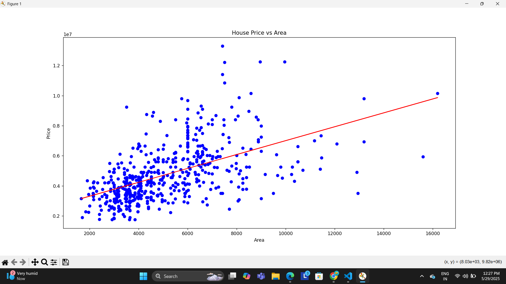

# Task03
# Linear Regression - House Price Prediction

## 📌 Objective
To implement and understand simple and multiple linear regression using the House Price dataset.

## 🧰 Tools Used
- Python
- Pandas
- Scikit-learn
- Matplotlib
- Jupyter Notebook

## 📊 Dataset
The dataset contains features such as:
- `area` (in sq ft)
- `bedrooms`
- `bathrooms`
- `price` (target)

## 🚀 Steps
1. Imported and cleaned the dataset
2. Performed simple & multiple linear regression
3. Trained model using `LinearRegression` from `sklearn`
4. Evaluated using MAE, MSE, R² score
5. Visualized regression line
6. Interpreted model coefficients

## 📈 Results
The model achieved an R² score of approximately 0.82, indicating a good fit for the data.

## 🔍 Visualization


## 📁 How to Run
```bash
python task03.py
```

## Dataset
You can download the housing dataset from [Kaggle](https://www.kaggle.com/datasets/harishkumardatalab/housing-price-prediction) or use the one provided here.
